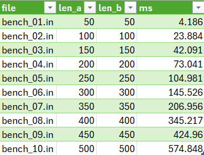
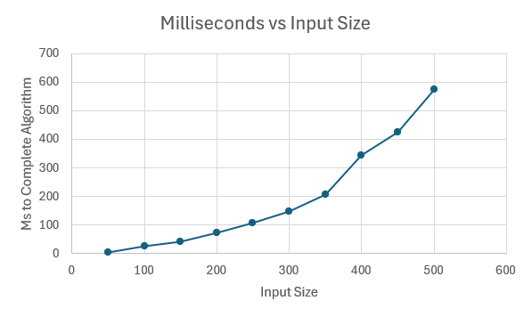

# COP4533-PA3

## Students

- William Jesser, UFID 5963-4986

## Project Layout

```text
COP4533-PA3/
|-- data/
|   |-- example.in
|   |-- example.out
|   `-- benchmarks/
|       |-- bench_01.in ... bench_10.in
|       `-- runtime_results.csv
|-- src/
|   |-- __init__.py
|   `-- weighted_lcs.py
|-- tests/
|   `-- test_weighted_lcs.py
|-- .gitignore
|-- README.md
`-- run.py
```

## Overview

This project solves the highest-value longest common subsequence problem. Given two strings and
a nonnegative value for each character, the program prints:

1. The maximum total value of a common subsequence
2. One optimal subsequence that achieves that value

The implementation in `src/weighted_lcs.py` uses top-down dynamic programming with memoization
and then reconstructs one optimal subsequence from the cached results.

## Requirements

- Python 3.9 or newer
- No third-party dependencies

## Build / Compile

No build step is required.

Optional syntax check:

```powershell
python -m py_compile .\run.py .\src\weighted_lcs.py
```

## Running The Program

Pass an input file directly:

```powershell
python .\run.py .\data\example.in
```

Each run prints the solver answer to standard output and the elapsed execution time to standard
error.

Write the result to a file:

```powershell
python .\run.py .\data\example.in --output .\data\result.out
```

Standard input also works:

```powershell
Get-Content .\data\example.in | python .\run.py
```

## Example Input And Output

- Example input: `data/example.in`
- Expected output: `data/example.out`

To reproduce the example:

```powershell
python .\run.py .\data\example.in
```

The output should match `data/example.out`.

## Running Tests

```powershell
python -m unittest discover -s .\tests -v
```

## Question 1: Empirical Comparison

I used 10 nontrivial benchmark inputs, each with `|A| = |B| >= 50`. The benchmark files are:

- `data/benchmarks/bench_01.in`
- `data/benchmarks/bench_02.in`
- `data/benchmarks/bench_03.in`
- `data/benchmarks/bench_04.in`
- `data/benchmarks/bench_05.in`
- `data/benchmarks/bench_06.in`
- `data/benchmarks/bench_07.in`
- `data/benchmarks/bench_08.in`
- `data/benchmarks/bench_09.in`
- `data/benchmarks/bench_10.in`

To time any benchmark run, execute the program on that file. For example:

```powershell
python .\run.py .\data\benchmarks\bench_01.in
```

The program will display the answer and then print a line like `Execution time: 4.186 ms`.
I used those displayed timings to build the graphs below.





The graph shows clear growth as the string sizes increase. Since both strings grow together, the
observed trend is consistent with the expected `O(|A| * |B|)` dynamic-programming runtime.

## Question 2: Recurrence Equation

Let `OPT(i, j)` be the maximum possible total value of a common subsequence between the suffixes
`A[i:]` and `B[j:]`.

Base cases:

- `OPT(i, j) = 0` if `i = |A|`
- `OPT(i, j) = 0` if `j = |B|`

Recurrence:

- If `A[i] = B[j]`, then
  - `OPT(i, j) = max(OPT(i + 1, j), OPT(i, j + 1), v(A[i]) + OPT(i + 1, j + 1))`
- If `A[i] != B[j]`, then
  - `OPT(i, j) = max(OPT(i + 1, j), OPT(i, j + 1))`

Why this is correct:

- Any optimal solution for suffixes `A[i:]` and `B[j:]` must do one of three things:
  - Skip `A[i]`
  - Skip `B[j]`
  - Use both characters, but only when `A[i] = B[j]`
- These cases are exhaustive, so the best answer must be the maximum among them.
- Each choice reduces the problem to a smaller suffix pair, which is exactly what dynamic
  programming needs.

## Question 3: Pseudocode And Big-Oh

The assignment objective is to maximize value. The pseudocode below computes that maximum value.
If literal subsequence length is required instead, replace `value(A[i])` with `1`.

```text
HVLCS-VALUE(A, B, value):
    n <- length(A)
    m <- length(B)
    create table DP[0..n][0..m]

    for i <- 0 to n:
        DP[i][m] <- 0
    for j <- 0 to m:
        DP[n][j] <- 0

    for i <- n - 1 downto 0:
        for j <- m - 1 downto 0:
            DP[i][j] <- max(DP[i + 1][j], DP[i][j + 1])
            if A[i] = B[j]:
                DP[i][j] <- max(DP[i][j], value(A[i]) + DP[i + 1][j + 1])

    return DP[0][0]
```

Runtime:

- There are `(n + 1) * (m + 1)` table entries.
- Each entry is filled in `O(1)` time.
- Total runtime is `O(nm)`.

Space usage:

- The full table uses `O(nm)` space.
- Reconstructing one optimal subsequence from the table takes an additional `O(n + m)` time.

## Assumptions

- Input format is:
  - Line 1: `K`, the number of characters with assigned values
  - Next `K` lines: a character and its nonnegative integer value
  - Next line: string `A`
  - Next line: string `B`
- If multiple optimal subsequences exist, any one of them is acceptable
- Characters not listed in the value table are treated as value `0`
